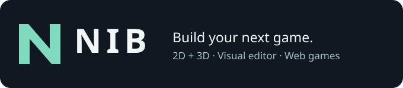

<strong>A visual editor for 2D and 3D browser games.</strong> Create levels, write gameplay, animate characters, add sound and publish your game.

<a href="https://github.com/MooradXO/NIB-Editor/releases/latest"><strong>Download 1.0.1</strong></a> · <a href="GETTING_STARTED.md">Get started</a> · <a href="docs/README.md">Documentation</a> · <a href="docs/PRESETS.md">Preset gallery</a> · <a href="https://github.com/MooradXO/NIB-Editor/discussions">Questions</a>

**NIB 1.0.1 is stable.** Free personal and commercial game development under the [NIB license](LICENSE),
with no mandatory subscription or royalties. Created and owned by **Murad Mammadov**, CEO of **ProjectAI**, Azerbaijan.

## Download and launch

1. Install [Node.js 24 LTS](https://nodejs.org/en/download), with **Add to PATH** enabled. Minimum: Node 22.12.
2. Download **[NIB-1.0.1.zip](https://github.com/MooradXO/NIB-Editor/releases/download/v1.0.1/NIB-1.0.1.zip)** and extract the whole archive into a writable folder.
3. On Windows double-click **start.bat**. On macOS/Linux run **sh start.sh**; see [platform qualification](docs/COMPATIBILITY.md).
4. Keep the terminal open and visit **[localhost:8670/editor/](http://localhost:8670/editor/)** in a desktop Chromium browser.

The editor needs **no npm install or engine build**. GitHub's automatic **Source code** ZIP contains this
documentation repository, not the editor. [Setup and troubleshooting](GETTING_STARTED.md) · [Upgrade safely](docs/PUBLISHING.md#upgrade-the-editor)

## Start with a real game

Ten small games include controls, art, sound, goals and replay or continuation. Six additional showcases
demonstrate rendering and animation. Two empty templates let you start from scratch.

| Relay Foundry · FPS | Emberwatch · arcade |
| --- | --- |
|  |  |
| Signal Harbor · campaign | The Drowned Reliquary · action |
|  |  |

Open **File → New Scene (Genres)** to choose one. **[Explore all 16 games and showcases →](docs/PRESETS.md)**

## Tools for your game

| Build | Included tools |
| --- | --- |
| Scenes and gameplay | Hierarchy, Inspector, gizmos, prefabs, JavaScript scripts, controllers, navigation and Play/Stop |
| 2D and 3D graphics | WebGL2/WebGPU, sprites, PBR materials, shadows, terrain, foliage, effects and post-processing |
| Characters | GLB models, rigs/weights, clips, animation state graphs, explicit retargeting and two-bone IK |
| Physics and sound | Built-in simulation, bundled Rapier, spatial audio, music, mixer buses and ambient zones |
| Projects and delivery | Folder projects, backups/recovery, multi-level HTML/ZIP export and optional Windows x64 packaging |
| Optional AI authoring | A local MCP server with **62 MCP tools**; no AI account is required to use the editor |

See the [complete capabilities and limits](docs/13-CAPABILITIES.md) and [tested environments](docs/COMPATIBILITY.md).
Presets are starting points for your own game. Multiplayer/cloud services and mobile/store packaging are outside this release.

## Learn and publish

- **New to NIB?** [Meet the editor](docs/06-GETTING-STARTED.md), then [build Collect Three](docs/FIRST-GAME.md).
- **Writing gameplay?** Start with [game scripting](docs/SCRIPTING.md) and the [Signal Harbor tutorial](docs/19-CAMPAIGN.md).
- **Looking for a tool?** Use the [documentation index](docs/README.md).
- **Ready to share?** Follow [publishing and upgrades](docs/PUBLISHING.md).
- **Need help?** Ask in [Discussions](https://github.com/MooradXO/NIB-Editor/discussions), report bugs in [Issues](https://github.com/MooradXO/NIB-Editor/issues), or read [Support](SUPPORT.md).

## License and project status

NIB is proprietary; this public repository distributes documentation and compiled editor downloads.
Engine/editor source remains private. The [license](LICENSE) permits free game development and embedding
the runtime in your games; your original game code and content remain yours. No NIB splash screen is required.
Preserve required notices. Standalone engine/editor redistribution and rebranding need separate permission.

Read [release history](CHANGELOG.md), [security reporting](SECURITY.md), [third-party notices](THIRD-PARTY-LICENSES.txt)
and [screenshot credits](docs/MEDIA.md). Keep the editor and optional MCP services local to your machine.
