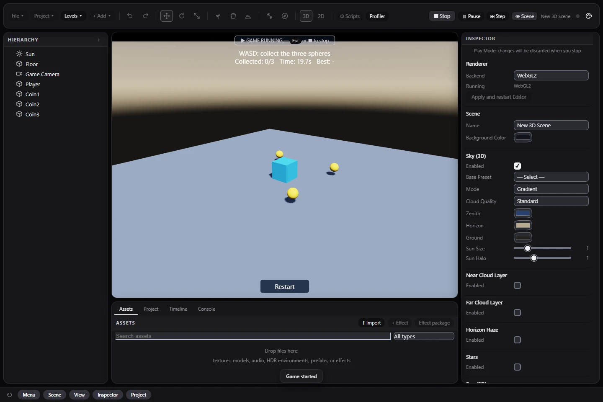
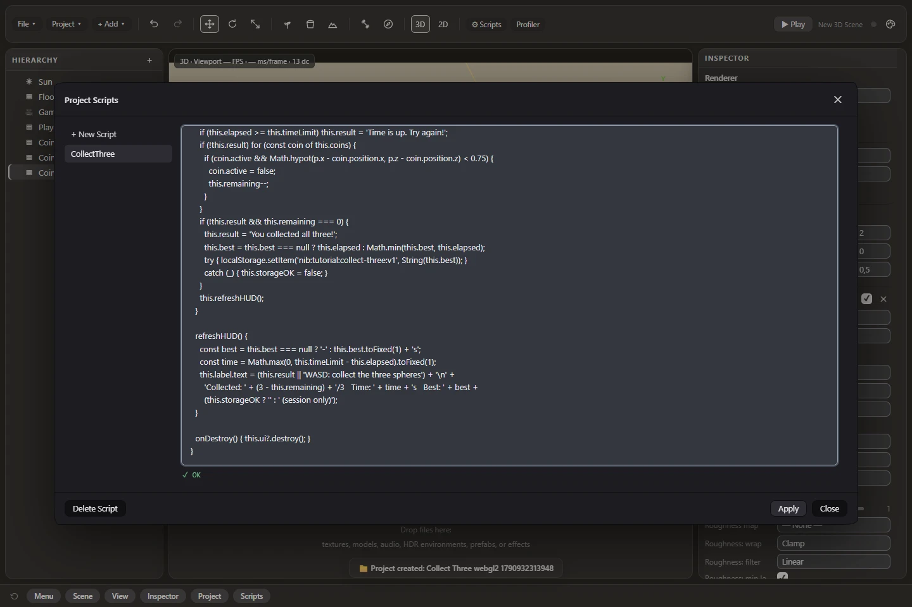

# Your first game: Collect Three

[Documentation](README.md) · [Editor tour](06-GETTING-STARTED.md) · [Scripting reference](SCRIPTING.md)

Build a small 3D game from **Empty 3D**. Move a blue cube with WASD, collect three yellow spheres
within 20 seconds, and retry after winning or losing. Your fastest successful time stays in local
browser storage when available. This exercise uses no downloaded art or additional dependencies.



## 1. Create the scene

Create a folder project called **Collect Three**, then choose **File → New Scene (Genres)… → Empty 3D → Create**.
Keep its Floor, Sun and Game Camera. Add the objects below through **+ Add**. Double-click each new
Hierarchy name to rename it exactly, and set Position and Scale in Inspector. Keep all four at scene
root level. Color is under the Mesh material controls; any clearly distinct colors work.

| Add | Rename to | Position X, Y, Z | Scale X, Y, Z | Color |
| --- | --- | --- | --- | --- |
| Box | Player | 0, 0.5, 0 | 1, 1, 1 | Blue |
| Sphere | Coin1 | -2, 0.5, -2 | 0.5, 0.5, 0.5 | Yellow |
| Sphere | Coin2 | 2, 0.5, -2 | 0.5, 0.5, 0.5 | Yellow |
| Sphere | Coin3 | 2, 0.5, 2 | 0.5, 0.5, 0.5 | Yellow |

This is direct movement on a flat XZ plane. Keep physics disabled for the exercise. The script
limits movement to the play area and detects collection by distance; it does not implement wall collision.

## 2. Add the game rules

Open **Scripts → + New Script**, name it **CollectThree**, and replace the generated template with
the complete code below. Close the window, select **Player**, add **Script** in Inspector and choose
**CollectThree**. Speed and Time Limit appear as editable parameters. Use positive values.



```js
class CollectThree extends NIB.Script {
  static params = { speed: 3, timeLimit: 20 };

  start() {
    this.coins = ['Coin1', 'Coin2', 'Coin3'].map(name => this.scene.find(name));
    if (this.coins.some(coin => !coin)) throw new Error('Create Coin1, Coin2 and Coin3 first.');
    this.home = this.entity.position.clone();
    this.best = null;
    this.storageOK = true;
    try {
      const value = Number(localStorage.getItem('nib:tutorial:collect-three:v1'));
      if (Number.isFinite(value) && value > 0 && value <= 600) this.best = value;
    } catch (_) { this.storageOK = false; }
    this.ui = this.entity.add(new NIB.Entity('Game HUD'));
    this.ui.addComponent(new NIB.UICanvas());
    this.label = this.ui.add(new NIB.Entity('Score')).addComponent(new NIB.UIElement({
      kind: 'text', anchorMinY: 0, anchorMaxY: 0, pivotY: 0, y: 18,
      width: 900, height: 80, fontSize: 24, background: '#122033'
    }));
    this.ui.add(new NIB.Entity('Retry')).addComponent(new NIB.UIElement({
      kind: 'button', text: 'Restart', action: 'event', value: 'retry',
      anchorMinY: 1, anchorMaxY: 1, pivotY: 1, y: -18, width: 180, height: 48
    }));
    this.resetRun();
  }

  resetRun() {
    this.entity.position.copy(this.home);
    for (const coin of this.coins) coin.active = true;
    this.remaining = 3;
    this.elapsed = 0;
    this.result = '';
    this.refreshHUD();
  }

  onUIAction(value) {
    if (value === 'retry') this.resetRun();
  }

  update(dt) {
    if (this.result) return;
    const input = this.engine.input;
    let x = input.axis('KeyA', 'KeyD');
    let z = input.axis('KeyW', 'KeyS');
    const length = Math.hypot(x, z);
    if (length > 1) { x /= length; z /= length; }
    const p = this.entity.position;
    p.x = Math.max(-4, Math.min(4, p.x + x * this.speed * dt));
    p.z = Math.max(-4, Math.min(4, p.z + z * this.speed * dt));
    this.elapsed += dt;
    if (this.elapsed >= this.timeLimit) this.result = 'Time is up. Try again!';
    if (!this.result) for (const coin of this.coins) {
      if (coin.active && Math.hypot(p.x - coin.position.x, p.z - coin.position.z) < 0.75) {
        coin.active = false;
        this.remaining--;
      }
    }
    if (!this.result && this.remaining === 0) {
      this.result = 'You collected all three!';
      this.best = this.best === null ? this.elapsed : Math.min(this.best, this.elapsed);
      try { localStorage.setItem('nib:tutorial:collect-three:v1', String(this.best)); }
      catch (_) { this.storageOK = false; }
    }
    this.refreshHUD();
  }

  refreshHUD() {
    const best = this.best === null ? '-' : this.best.toFixed(1) + 's';
    const time = Math.max(0, this.timeLimit - this.elapsed).toFixed(1);
    this.label.text = (this.result || 'WASD: collect the three spheres') + '\n' +
      'Collected: ' + (3 - this.remaining) + '/3   Time: ' + time + 's   Best: ' + best +
      (this.storageOK ? '' : ' (session only)');
  }

  onDestroy() { this.ui?.destroy(); }
}
```

The first block finds the three spheres and creates the score label and Restart button during Play.
Update moves the player, checks time and collection, then changes the message. Restart restores all
three spheres. The HUD belongs to the runtime scene and disappears on Stop.

## 3. Play, win and lose

Press **Play**, then click the game viewport so WASD reaches the game. W/S move along Z; A/D move
along X. Collect all three spheres: the count becomes 3/3 and the winning message appears.
Press **Restart**, click the viewport again, and wait 20 seconds without collecting: the failure
message appears. Restart works after either outcome. If focus loss pauses the game, choose Resume game.

If nothing moves, check the Player's Script attachment, exact class/object names and Console.
If the HUD is missing, make sure the complete script was copied. The initial perspective camera
looks diagonally across the XZ floor; W is world-forward rather than camera-relative movement.

## 4. Save and reopen

Stop, choose **File → Save Project**, wait for **Project saved**, close the project and reopen it.
The authored Player, spheres and script must remain. Play starts a fresh round. The best time is
separate from the project save and belongs to this browser profile and origin. Clearing browser data
removes it. An export on another origin has a separate best; unavailable storage keeps a session best.

## 5. Export and share

Use **File → Export Game (Single HTML)**. Open the downloaded file independently, play a round and
restart. For a stable hosting origin and repeatable best-score persistence, use a web host or the
[Web Project workflow](PUBLISHING.md). Test the exported game after closing the editor tab.

## Try a small change

- Move Coin2 and verify the script collects it at its new position.
- Set Time Limit to 10, or Speed to 4, then save and replay.
- Change the colors and HUD text; keep the unique object and class names.
- Replace raw WASD with [named input actions](18-INPUT.md) before adding touch or controller support.

Next, explore [Emberwatch](24-EMBERWATCH.md) for combat or [Signal Harbor](19-CAMPAIGN.md) for multiple
levels and checkpoints. The two starter presets themselves are unchanged by this tutorial.
