# Preset gallery

[Documentation](README.md) · [Download NIB](https://github.com/MooradXO/NIB-Editor/releases/latest)

NIB 1.0.0 includes **ten small games, six showcases and two empty templates**.
Open **File → New Scene (Genres)…**, select the **menu name** below and confirm **Create**, then Play.
Save existing work before replacing a scene. Screenshots show the real stable Editor in Play;
these are included examples, not claims about every game you can make.

## Games

### Signal Harbor

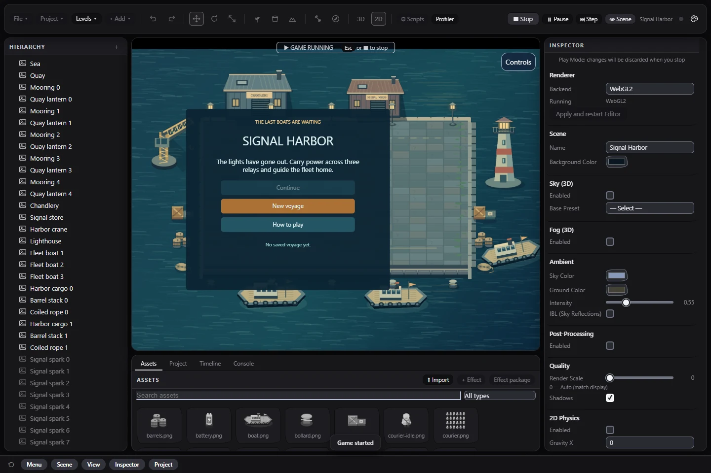

**Menu name:** Signal Harbor — Campaign · **2D**

An illustrated working harbor: collect batteries, avoid maintenance patrols and transmit three signals to guide the fleet home. Animated courier, original sound, menu, pause, local save/continue, ending and editable tutorial scripts. Includes all five levels in the current scene.

- **Controls:** WASD/arrows to move; E to transmit; K to save; P to pause.
- **Learn:** Multi-level campaign, Game UI, checkpoints and input actions.
- **Customize:** Change UI text, patrol parameters and sprite assets; follow the campaign guide for bundled relay records.
- **Guide:** [Open the relevant walkthrough](19-CAMPAIGN.md).

### Relay Foundry

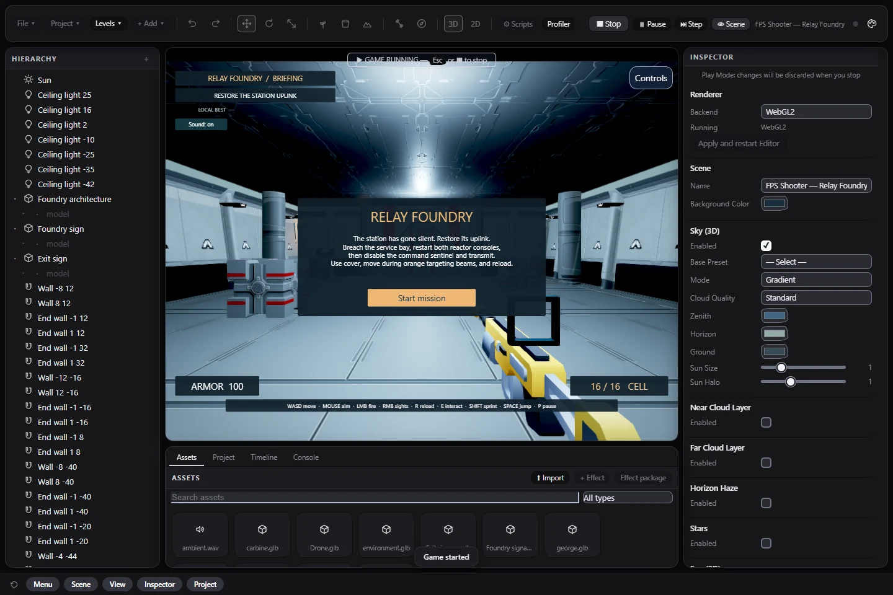

**Menu name:** FPS Shooter · **3D**

Relay Foundry: breach three station sectors, fight animated security mechs, restore four consoles and extract. Carbine sights, reload, cover, repair kits and a local best.

- **Controls:** WASD move; mouse aim; left/right mouse fire/sights; R reload; E interact.
- **Learn:** FPS controls, animated enemies, mission objectives and authored environments.
- **Customize:** Edit ShooterManager, colliders, lights and model placements.
- **Guide:** [Open the relevant walkthrough](PRESET-DETAILS.md#relay-foundry--fps-shooter).

### Port Azure

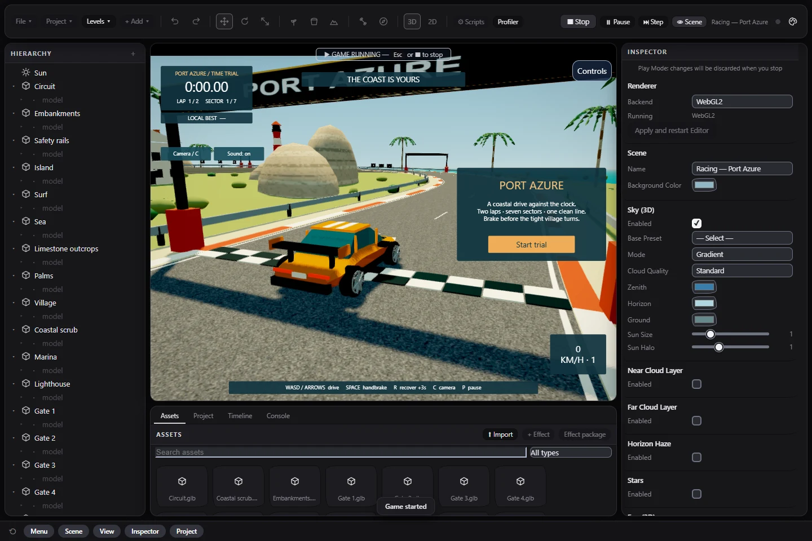

**Menu name:** Racing · **3D**

Port Azure: a detailed GT car on a coastal circuit, two-lap time trials, handbrake turns, recovery, camera views and a local best.

- **Controls:** WASD/arrows drive; Space handbrake; R recover; C camera; P pause.
- **Learn:** Arcade vehicle movement, cameras, timing and generated models.
- **Customize:** Change RaceManager rules, placed props and materials.
- **Guide:** [Open the relevant walkthrough](PRESET-DETAILS.md#port-azure--racing).

### Emberwatch

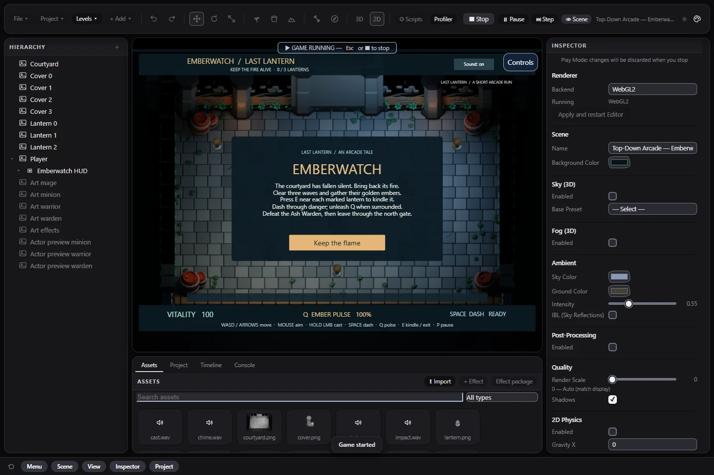

**Menu name:** Top-Down Arcade · **2D**

Emberwatch: restore three lanterns in a ruined courtyard, fight animated enemies and the Ash Warden, dash through danger and unleash ember pulses. A complete run with retry and a local best.

- **Controls:** WASD move; mouse aim; left mouse fire; Space dash; Q pulse; E lantern.
- **Learn:** Sprite animation, waves, cover, combat and a boss encounter.
- **Customize:** Edit ArcadeManager, lantern positions, cover and sprites.
- **Guide:** [Open the relevant walkthrough](24-EMBERWATCH.md).

### The Velvet Table

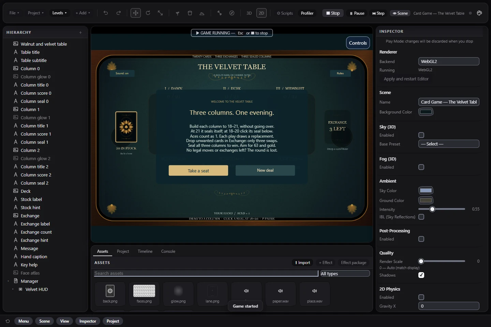

**Menu name:** Card Game · **2D**

The Velvet Table: an engraved solitaire. Build three columns to 18–21 with twenty cards and three exchanges. Drag or select cards, seal columns, earn a medal and replay a deal.

- **Controls:** Drag cards or select/click; arrows and 1/2/3 choose a column; B seal; D exchange.
- **Learn:** 2D interface, drag interaction, finite rules and replayable deals.
- **Customize:** Edit dealSeed, layout, labels, card atlas and sounds.
- **Guide:** [Open the relevant walkthrough](04-EDITOR.md#the-velvet-table).

### Tinker Yard

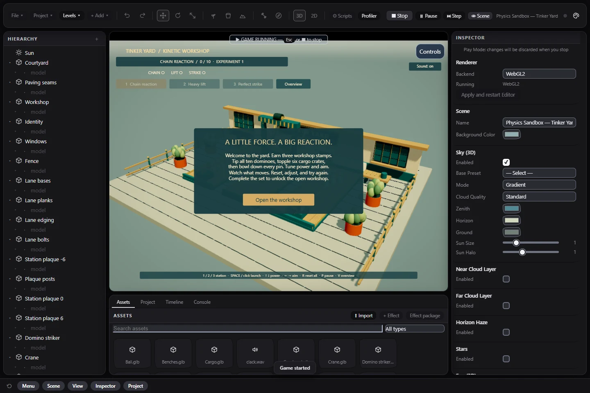

**Menu name:** Physics Sandbox · **3D**

Tinker Yard: a crafted kinetic workshop. Tune and launch a domino cascade, cargo pendulum and bowling lane, earn three stamps, then keep experimenting.

- **Controls:** 1/2/3 station; arrows power/aim; Space launch; V overview; R reset.
- **Learn:** Rapier bodies, joints and experiments scored from actual motion.
- **Customize:** Move bodies, adjust colliders/joints and change SandboxManager.
- **Guide:** [Open the relevant walkthrough](04-EDITOR.md#tinker-yard-physics-workshop).

### Emerald Reach

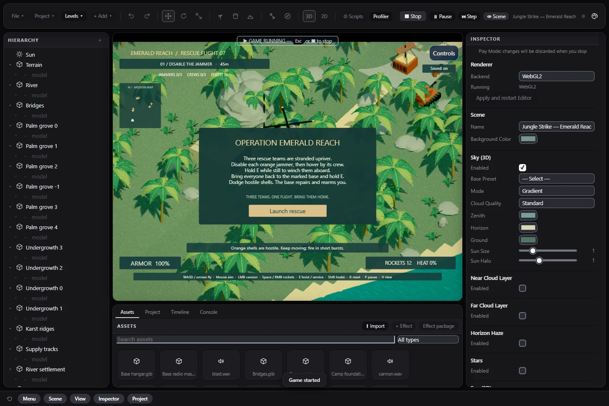

**Menu name:** Jungle Strike · **3D**

Emerald Reach: fly a detailed rescue helicopter through a tropical river valley. Suppress three jammers, winch stranded crews aboard, and return home. WASD flight, mouse aim, cannon/rockets, E hoist, Shift brake.

- **Controls:** WASD/arrows fly; mouse aim; left fire; Space/right rockets; E hoist; Shift brake.
- **Learn:** Arcade flight, animated models, rescue objectives and sound.
- **Customize:** Edit the helicopter, jammers, crews, materials and mission script.
- **Guide:** [Open the relevant walkthrough](04-EDITOR.md#emerald-reach-rescue-flight).

### The Drowned Reliquary

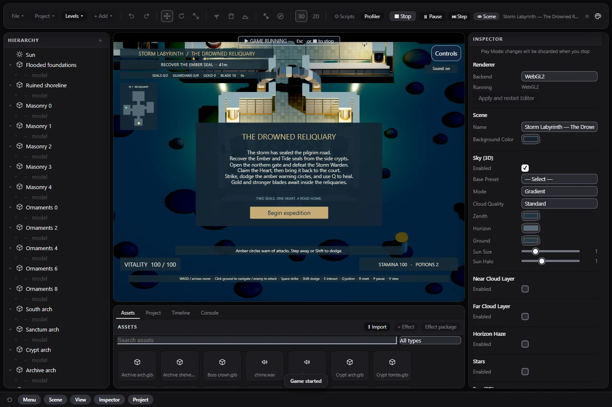

**Menu name:** Storm Labyrinth · **3D**

The Drowned Reliquary: recover two seals, defeat the Storm Warden and bring the Heart home. Authored crypts, animated sword combat, click navigation, dodge, potions, loot, stronger blades and a local best.

- **Controls:** Use the in-game control panel for movement, combat, dodge and potions.
- **Learn:** Animated characters, grid navigation, combat, loot and atmosphere.
- **Customize:** Edit scene placements, character components and game scripts.
- **Guide:** [Open the relevant walkthrough](10-CHARACTERS.md).

### Courier's Wake

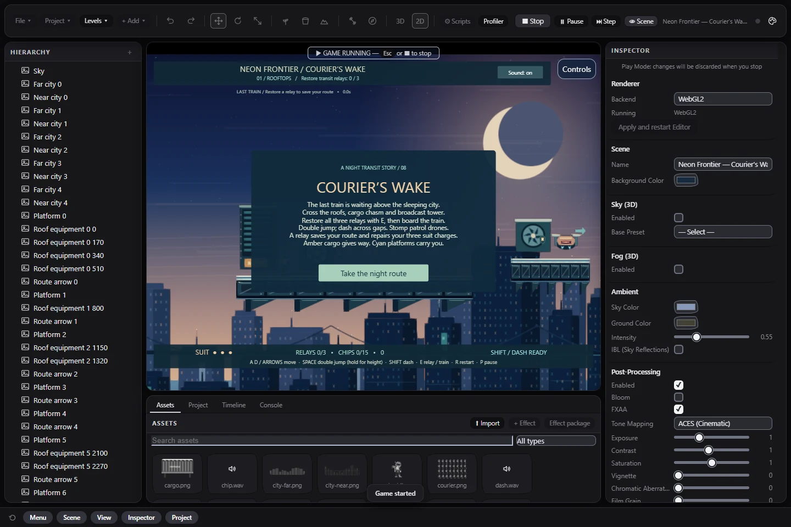

**Menu name:** Neon Frontier · **2D**

Courier’s Wake: carry the last transit signal across illustrated rooftops, cargo chasms and a broadcast tower. Restore three checkpoint relays and board the train. Animated courier, patrol drones, collapsing cargo, magnetic platforms and parallax city. A/D move, Space double jump, Shift dash, E relay/train, R restart, P pause, M sound.

- **Controls:** A/D move; Space/W/up double jump; Shift dash; E relay/train; R restart.
- **Learn:** Illustrated platformer, hazards, checkpoints, parallax and moving platforms.
- **Customize:** Move authored platforms, relays and actors; edit sprites and rules.
- **Guide:** [Open the relevant walkthrough](04-EDITOR.md#couriers-wake-platform-route).

### The Last Shift

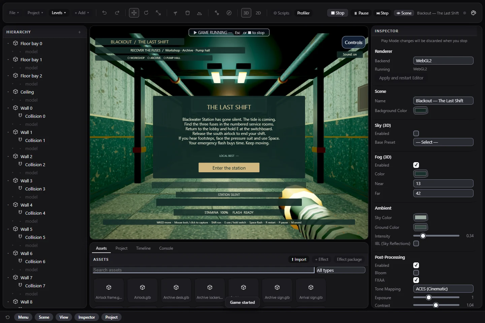

**Menu name:** Blackout (Horror) · **3D**

The Last Shift: explore a decaying pumping station, recover three fuses, start the switchboard and escape the airlock. A stalking pressure suit, emergency lamp flash, authored materials, machinery and sound. WASD / mouse, Shift run, E interact, Space flash, R restart, P pause.

- **Controls:** WASD/mouse move/look; Shift run; E interact; Space lamp flash; R restart.
- **Learn:** First-person exploration, pursuit, lighting, sound and interaction.
- **Customize:** Edit station objects, collision rectangles, fuses and game rules.
- **Guide:** [Open the relevant walkthrough](04-EDITOR.md#blackout--the-last-shift).

## Rendering and animation showcases

### Retro/PS1

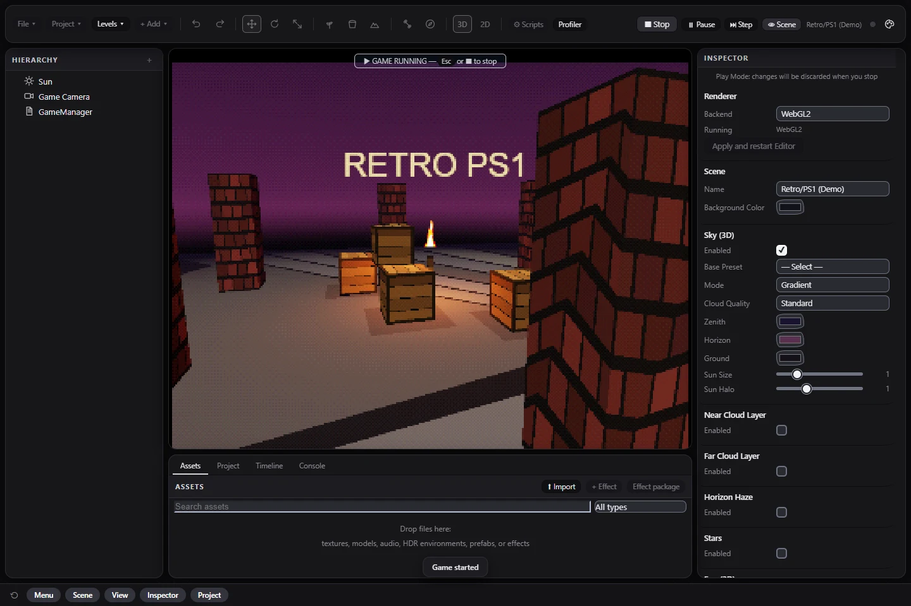

**Menu name:** Retro/PS1 (Demo) · **3D**

Retro-pack showcase in a PlayStation 1-style courtyard with 16-color RGB555 CLUT textures, dithered 320x240 pixelation and 4:3 framing, vertex-snapped polygon wobble, affine textures, subtractive shadows, a flaming torch, dense fog, and an SDF title. All retro settings are available under Post-Processing.

- **Controls:** Use the scene controls and Inspector; inspect Post-Processing for retro settings.
- **Learn:** Pixelation, dithering, affine textures, vertex snapping and stylized fog.
- **Customize:** Adjust the retro settings, lighting and courtyard objects.
- **Guide:** [Open the relevant walkthrough](09-EFFECTS.md).

### Blade Showcase

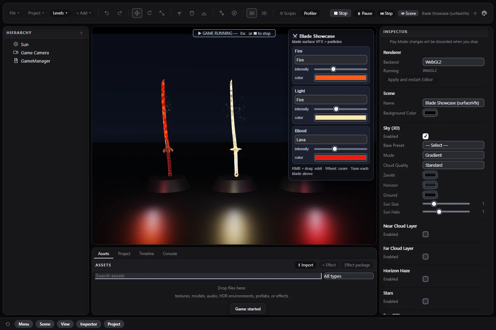

**Menu name:** Blade Showcase · **3D**

Three Meshy-generated katanas demonstrate blade-masked surface VFX, smoke, sparks, light motes, blood droplets, and per-blade effect controls.

- **Controls:** Use the on-screen per-blade effect controls.
- **Learn:** Surface VFX, layered particles and imported textured models.
- **Customize:** Change blade effects, materials and light settings.
- **Guide:** [Open the relevant walkthrough](09-EFFECTS.md).

### Biome Footprints

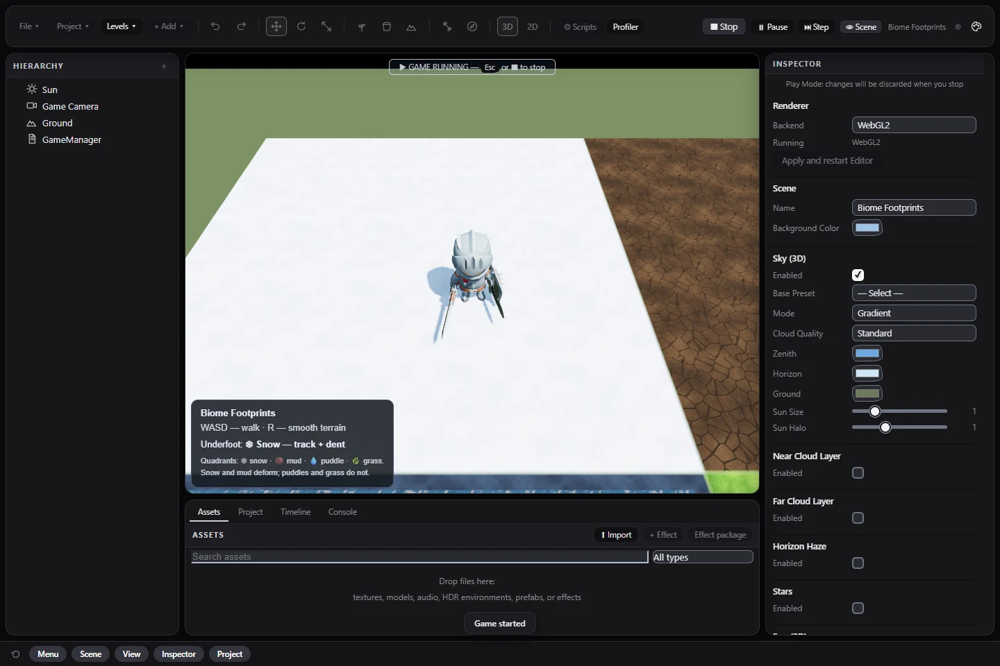

**Menu name:** Biome Footprints · **3D**

A terrain-footprint showcase across snow, mud, puddle, and grass biomes. WASD to walk; R to smooth the terrain.

- **Controls:** WASD walk; R smooth terrain.
- **Learn:** Terrain surfaces, footprints and vegetation.
- **Customize:** Change terrain, surface layers and placed props.
- **Guide:** [Open the relevant walkthrough](13-CAPABILITIES.md#worlds-physics-and-navigation).

### Rig Showcase

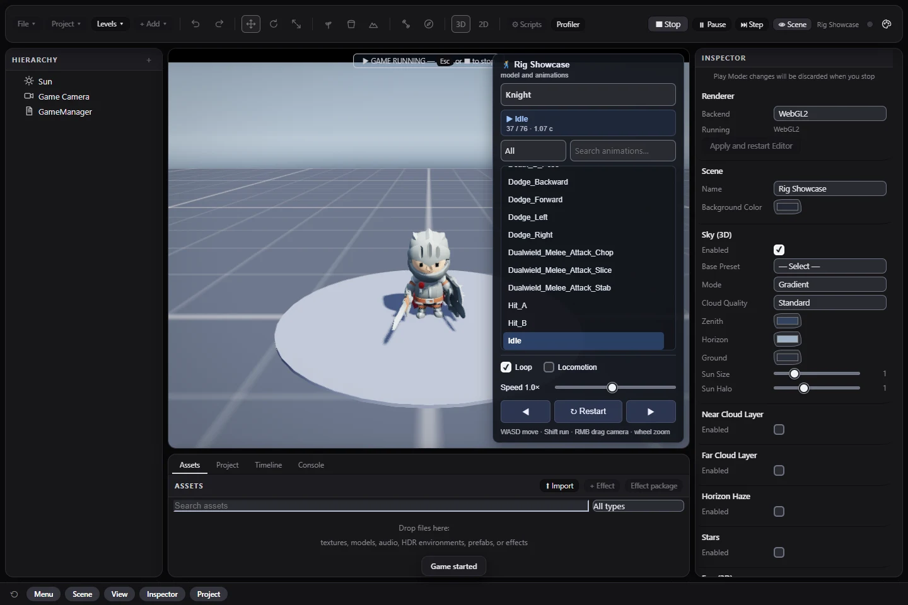

**Menu name:** Rig Showcase · **3D**

A skeletal-animation studio with five switchable CC0 rigs, animation playback controls, locomotion, and an orbit camera.

- **Controls:** Use the model, clip, playback and orbit controls in the scene.
- **Learn:** Imported rigs, clips and skeletal animation.
- **Customize:** Inspect model animation, then open Character or Animation editor.
- **Guide:** [Open the relevant walkthrough](10-CHARACTERS.md).

### Real PBR Textures

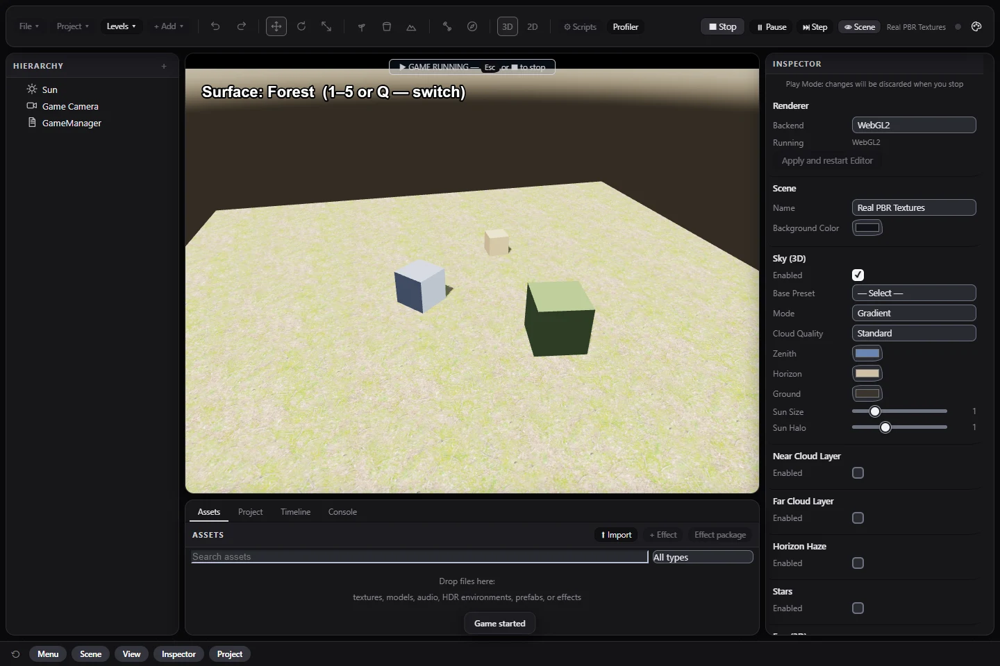

**Menu name:** Real PBR Textures · **3D**

Five real Poly Haven CC0 surface sets with color, OpenGL normal, and roughness maps. Use keys 1–5 or Q to switch surfaces.

- **Controls:** 1–5 or Q switch surfaces.
- **Learn:** Color, normal and roughness maps with lighting.
- **Customize:** Choose textures, material factors and lighting.
- **Guide:** [Open the relevant walkthrough](15-MODELS.md).

### Real Foliage

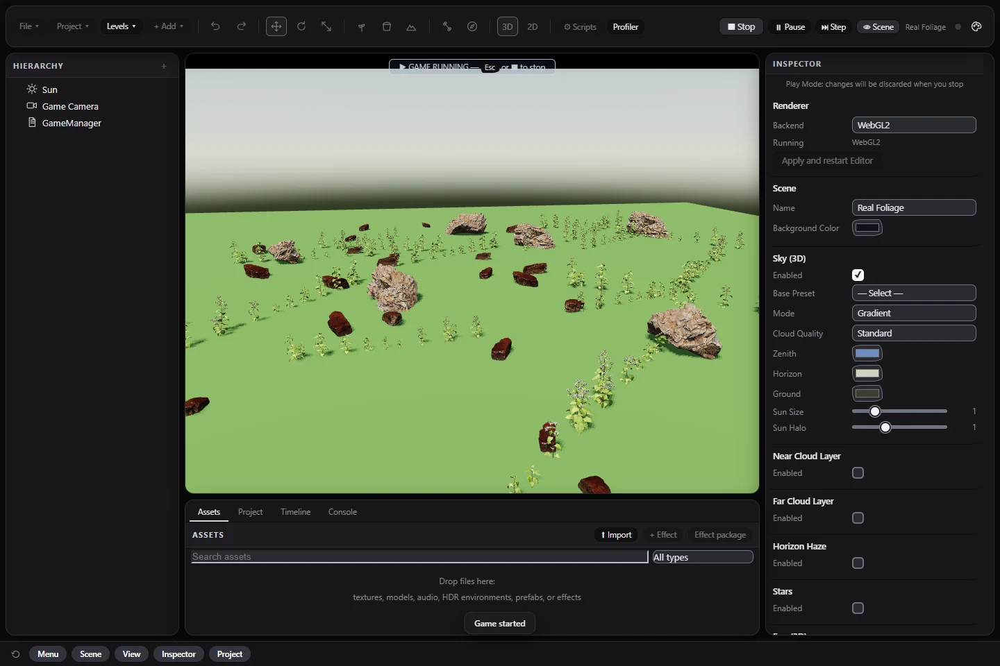

**Menu name:** Real Foliage · **3D**

Poly Haven CC0 rocks, boulders, and shrubs scattered across a lit clearing with varied rotation, scale, shadows, and an orbit camera.

- **Controls:** Use the on-screen orbit camera controls.
- **Learn:** Imported foliage/rocks, transform variation and shadows.
- **Customize:** Change instance placement, scale, density and lighting.
- **Guide:** [Open the relevant walkthrough](13-CAPABILITIES.md#worlds-physics-and-navigation).

## Empty templates

- **Empty 3D:** sun, floor and camera. Use it for [Collect Three](FIRST-GAME.md).
- **Empty 2D:** a platform and 2D physics. Add your own player, camera, rules and artwork.

The templates have not been modified for this documentation update. Physical controller/touch support
needs game-specific testing. See [compatibility](COMPATIBILITY.md) and [asset attribution](MEDIA.md).
